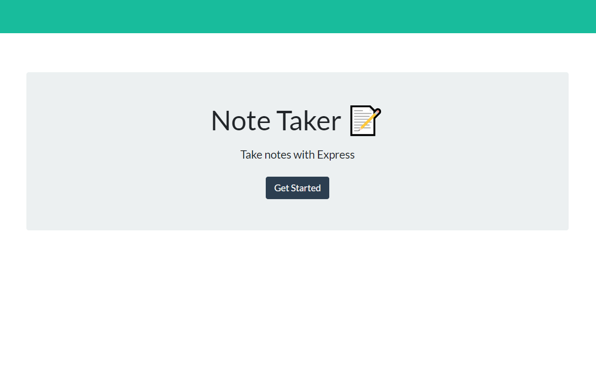
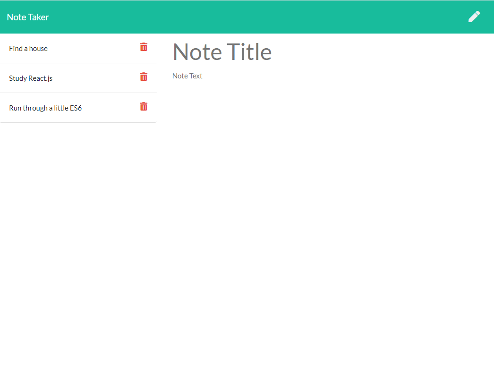

# The Express Note-Taker

## Table of Contents

1. [Description](#Description)
2. [Installation](#Installation)
3. [Deployment](#Deployment)
4. [Screenshots](#Screenshots)


## Description

This application enables the user to write, save, and delete notes. It will use an express backend as well as saves and retrieves note data from a JSON file. This was accomplished by using methods such as GET, POST, and DELETE.

## Installation 

* Clone the repository to your local machine
* Install the necessary npm packages by typing in the following command in the terminal:

```
npm install
```

## Deployment 

* This app is simple to run and is set up to use port 9000 for local running. Start the program with the code snippit below

```
node server.js
```

* You may also navigate to the live app deployed on [Heroku here](https://note-taker-lakis006.herokuapp.com/) and get started! Saved notes will render to the left of the screen. You may view saved notes by simply clicking on them. 

## Screenshots

* 

* 